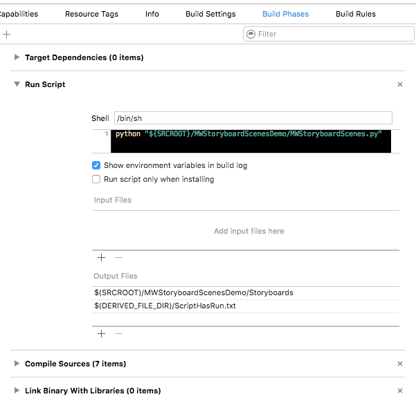

# MWStoryboardScenes

The meat of this project is the MWStoryboardScenes.py Python script that creates initiator methods for all your storyboard scenes.

## Installation

Just put the MWStoryboardScenes.py file somewhere within your project, i.e. in a Scripts folder or Resources folder or whatever.

## Setup

At the top of the script, there is a CONFIG_OPTIONS where you need to specify your storyboard names and their respective filenames. 
Since we have separate files for iPad and iPhone, these get a common name in the generated code (i.e. MainStoryboard), which is built based on info found in the MainStoryboard_iPhone and MainStoryboard_iPad storyboards.

Also, you need to provide the path to your storyboard files.

The script needs to run on every build, so that any changes to your storyboards are reflected in the generated code before the rest of your code is built. 

You do this by adding a new Run Script to your Build Phases:
 

Add two output files: 
The Storyboards (no file extension) will be used for creating the Storyboards.swift file and the PREFIXStoryboards.h/.m files. You can of course name this file whatever you want.

The ScriptHasRun.txt file in the derived dir is only a dummy file that makes sure that the script is always run. We had issues that xcode often did not detect necessary changes and didn't run the script on every build unless we had this...

## Generated code

Swift code will look like this:
```swift
// MARK: -  Storyboard identifier enums

enum MainStoryboardIdentifier: String {
    case SwiftPage2 = "swiftPage2"
    case SwiftPage1 = "swiftPage1"

}

enum ObjcStoryboardIdentifier: String {
    case ObjcPage1 = "objcPage1"
    case ObjcPage2 = "objcPage2"

}

public class Storyboards: NSObject {

    // MARK: - Instantiators for MainStoryboard-- */

    static func instantiateSwiftPage2() -> Page2ViewController {
        return self.mainStoryboard.instantiateViewControllerWithIdentifier(MainStoryboardIdentifier.SwiftPage2.rawValue) as! Page2ViewController
    }

    static func instantiateSwiftPage1() -> Page1ViewController {
        return self.mainStoryboard.instantiateViewControllerWithIdentifier(MainStoryboardIdentifier.SwiftPage1.rawValue) as! Page1ViewController
    }

    // MARK: - Instantiators for ObjcStoryboard-- */

    static func instantiateObjcPage1() -> MWObjcPage1ViewController {
        return self.objcStoryboard.instantiateViewControllerWithIdentifier(ObjcStoryboardIdentifier.ObjcPage1.rawValue) as! MWObjcPage1ViewController
    }

    static func instantiateObjcPage2() -> MWObjcPage2ViewController {
        return self.objcStoryboard.instantiateViewControllerWithIdentifier(ObjcStoryboardIdentifier.ObjcPage2.rawValue) as! MWObjcPage2ViewController
    }

    // MARK: -  Private storyboard initializers

    private static var mainStoryboard : UIStoryboard {
        let identifier = UIDevice.currentDevice().userInterfaceIdiom == .Pad ? "MainStoryboard_iPad" : "MainStoryboard_iPhone"
        return UIStoryboard(name: identifier, bundle: nil)
    }

    private static var objcStoryboard : UIStoryboard {
        let identifier = UIDevice.currentDevice().userInterfaceIdiom == .Pad ? "ObjcStoryboard_iPad" : "ObjcStoryboard_iPhone"
        return UIStoryboard(name: identifier, bundle: nil)
    }

}
```

Objective-C:
```objective-c
@implementation MWStoryboards

#pragma mark -  MainStoryboard instantiators

+ (MWPage2ViewController *)instantiateSwiftPage2 {
    return (MWPage2ViewController *)[[MWStoryboards MainStoryboard] instantiateViewControllerWithIdentifier:@"swiftPage2"];
}

+ (MWPage1ViewController *)instantiateSwiftPage1 {
    return (MWPage1ViewController *)[[MWStoryboards MainStoryboard] instantiateViewControllerWithIdentifier:@"swiftPage1"];
}


#pragma mark -  ObjcStoryboard instantiators

+ (MWObjcPage1ViewController *)instantiateObjcPage1 {
    return [[MWStoryboards ObjcStoryboard] instantiateViewControllerWithIdentifier:@"objcPage1"];
}

+ (MWObjcPage2ViewController *)instantiateObjcPage2 {
    return [[MWStoryboards ObjcStoryboard] instantiateViewControllerWithIdentifier:@"objcPage2"];
}


#pragma mark - Private storyboard initializers

+ (UIStoryboard *)MainStoryboard {
    NSString *identifier = UI_USER_INTERFACE_IDIOM() == UIUserInterfaceIdiomPad ? @"MainStoryboard_iPad" : @"MainStoryboard_iPhone";
    return [UIStoryboard storyboardWithName:identifier bundle:nil];
}

+ (UIStoryboard *)ObjcStoryboard {
    NSString *identifier = UI_USER_INTERFACE_IDIOM() == UIUserInterfaceIdiomPad ? @"ObjcStoryboard_iPad" : @"ObjcStoryboard_iPhone";
    return [UIStoryboard storyboardWithName:identifier bundle:nil];
}


@end
```

## Usage

To use this in your other files, simply do this:

Swift:
```swift
let page2VC = Storyboards.instantiateSwiftPage2()
```

Objective-C:
```objective-c
MWObjcPage2ViewController *page2VC = [MWStoryboards instantiateObjcPage2];
```

This means that at call site, you do not ever need to worry about what storyboard a certain scene belongs to. Auto-completion will help you find the correct function once you start typing Storyboards.instantiate... 

## Roadmap

The primary goal for improving this project is generifying the script. It was created for use in the FINN.no app, and we have separate storyboards for iPhone and iPad, and the script reflects this. It would be better if there was a more generic approach to this, or if it was at least possible to include a config for this.

Another improvement would be to have the script scan your projects folder for all storyboard files instead of specifying them at the top of the script. This must of course exclude any storyboards in third-party frameworks etc.

Feel free to create a pull request if you use this script and make improvements to it!
